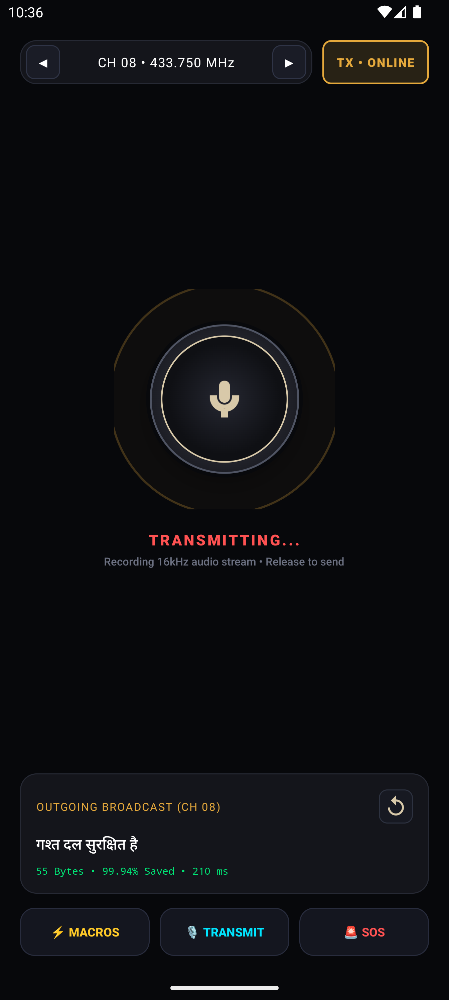
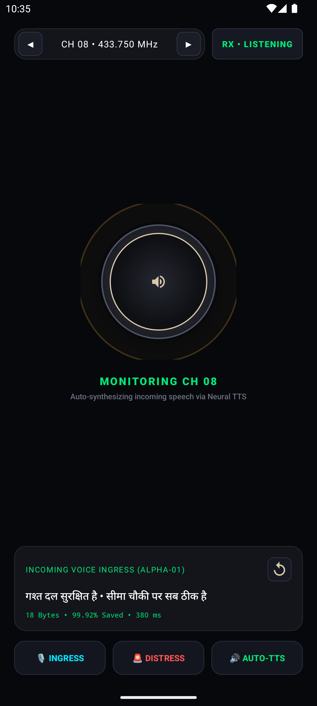
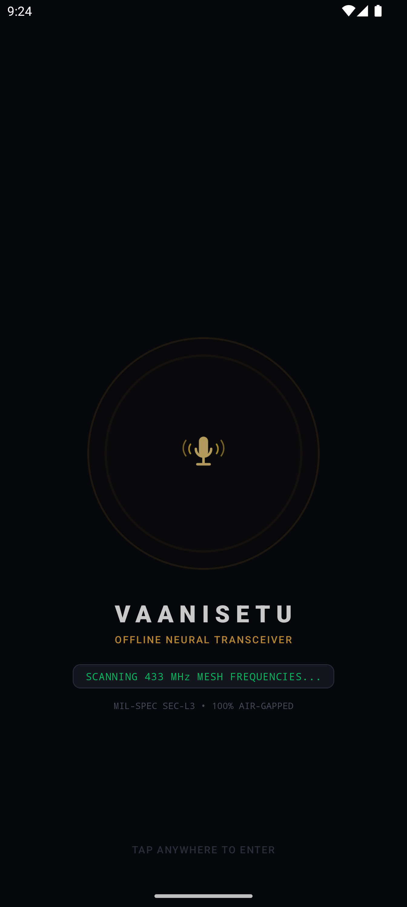
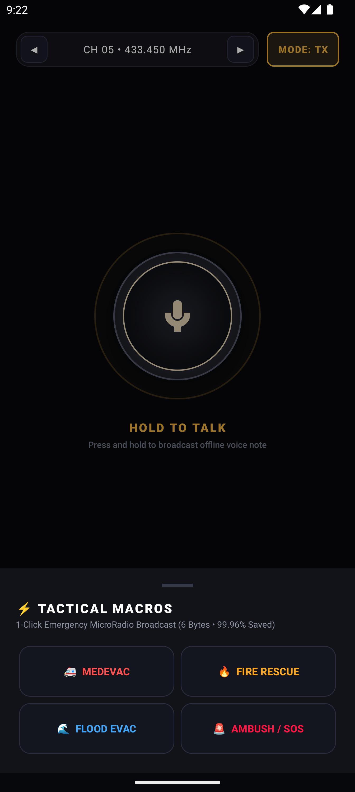
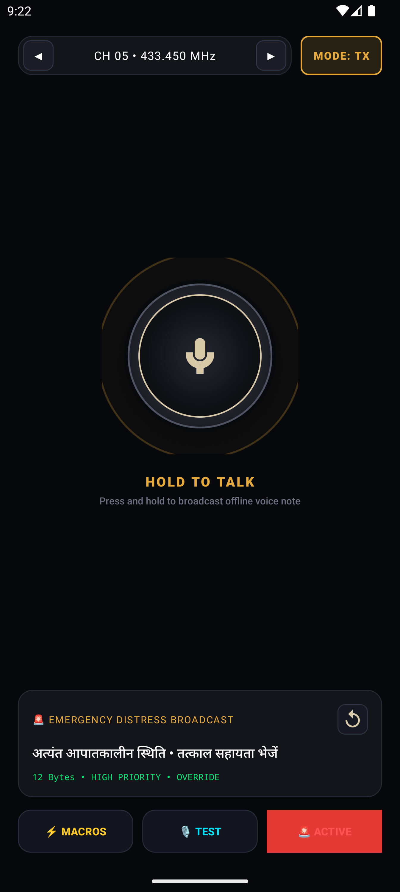

# VaaniSetu (वाणी सेतु) — Offline Tactical Voice Transceiver & Walkie-Talkie

[](https://developer.android.com)
[](https://kotlinlang.org)
[](https://isocpp.org)
[](https://python.org)
[](tests/)
[](#)
[](LICENSE)

**VaaniSetu (वाणी सेतु)** is an ultra-lightweight, 100% offline tactical voice transceiver and digital walkie-talkie platform engineered for mission-critical disaster recovery, defense field operations, and air-gapped environments.

By fusing on-device neural Speech-to-Text (STT), neural Text-to-Speech (TTS), and an ultra-compressed **6-byte binary MicroRadio protocol** (achieving **99.96% bandwidth savings**), VaaniSetu enables real-time multilingual voice broadcasts across **10 Indic languages** on standard Android smartphones, embedded micro-radios, and web simulators with **zero internet, cell tower, or cloud dependency**.

---

## 📱 Separate Sender & Receiver Applications (Live Android Apps)

VaaniSetu provides **two dedicated standalone Android applications** that install and run side-by-side:

| VaaniSetu Sender (`com.vaanisetu.sender`) | VaaniSetu Receiver (`com.vaanisetu.receiver`) |
| :---: | :---: |
|  |  |
| **Field Transceiver Unit**: 3D PTT Button, offline STT, 6-byte binary broadcast, tactical emergency macros | **Command Listening Station**: Acoustic spectrum monitor, packet decode, auto-neural Indic TTS readout |

### Additional Interactive Features

| Startup Radar Animation | Slide-Up Tactical Macros | Emergency Override Broadcast |
| :---: | :---: | :---: |
|  |  |  |

---

## ⚡ Performance Benchmarks (Real-Time Factor / Speed)

| Module | Implementation | Model | Model Size | Speed (Latency) | Real-Time Factor (RTF) |
|:---|:---|:---|:---:|:---:|:---:|
| **STT** | **Native C++** | Zipformer-small (int8) | ~107 MB | **61 ms** (for 6.6s audio) | **0.009 RTF (~110x faster)** |
| **STT** | Python wrapper | Zipformer-small (int8) | ~107 MB | **80 ms** (for 6.6s audio) | **0.012 RTF (~80x faster)** |
| **TTS** | **Native C++** | Piper VITS (lessac-low) | ~64 MB | **132 ms** (for 2.4s audio) | **0.054 RTF (~18x faster)** |
| **TTS** | Python wrapper | Piper VITS (lessac-low) | ~64 MB | **60 ms** (for 1.4s audio) | **0.040 RTF (~25x faster)** |
| **VAD** | Native C++ / Python | Silero VAD (ONNX) | ~0.6 MB | **< 1 ms** per window | **< 0.005 RTF** |

---

## 🚀 Dual Architecture: C++, Kotlin & Python

VaaniSetu provides a 3-tier architecture so every layer can be used:

```
┌─────────────────────────────────────────────────────────────┐
│                    KOTLIN (Android Layer)                   │
│  - NativeSTT.kt (ASR Controller)                            │
│  - NativeTTS.kt (TTS Controller)                            │
│  - AudioRecorder.kt (16kHz mono low-latency mic input)      │
│  - AudioPlayer.kt (16kHz mono low-latency speaker playback) │
│  - P2PTransport.kt (WiFi Direct / Bluetooth P2P sockets)    │
└──────────────────────────────┬──────────────────────────────┘
                               │ JNI (0-copy memory bridge)
┌──────────────────────────────▼──────────────────────────────┐
│                    C++ NATIVE ENGINE CORE                   │
│  - vaanisetu::STTEngine (Zipformer INT8 + Silero VAD)       │
│  - vaanisetu::TTSEngine (Piper VITS ONNX)                   │
│  - vaanisetu::WavIO (Zero-dependency PCM WAV I/O)           │
│  - Standalone binaries: vaanisetu_stt_cli, vaanisetu_tts_cli│
└─────────────────────────────────────────────────────────────┘
                               ▲
┌──────────────────────────────┴──────────────────────────────┐
│                    PYTHON (Prototyping & Tests)             │
│  - SherpaSTTEngine & SherpaTTSEngine                        │
│  - Automated pytest test suite                              │
└─────────────────────────────────────────────────────────────┘
```

---

## 📁 Clean Repository Structure

```
VaaniSetu/
├── android/                       # Native Android Application & Library
│   ├── app/                       # Material 3 Walkie-Talkie Android App
│   │   └── src/main/
│   │       ├── AndroidManifest.xml
│   │       ├── kotlin/com/vaanisetu/app/   # WalkieTalkieActivity, Service, EmergencyAlert
│   │       └── res/                        # 3D PTT selectors, LCD themes, tactical icons
│   ├── vaanisetu-core/            # Kotlin Transceiver Library Module
│   │   ├── build.gradle.kts       # Configured with CMake & Android NDK (arm64-v8a, armeabi-v7a)
│   │   └── src/
│   │       ├── main/kotlin/com/vaanisetu/core/  # TransceiverEngine, MicroRadio, DSP, JNI
│   │       └── test/kotlin/com/vaanisetu/core/  # Core transceiver unit tests (100% pass)
│   ├── build.gradle.kts           # Root gradle config
│   ├── settings.gradle.kts        # Multi-module settings
│   └── gradlew                    # Gradle 8.9 wrapper
│
├── web_walkie_talkie/             # Tactical Web Walkie-Talkie Simulator
│   ├── index.html                 # Luxury obsidian/gold tactical walkie-talkie UI
│   ├── style.css                  # Hardware-accelerated CSS3 animations & slide-up drawers
│   ├── app.js                     # WebAudio API DSP & bidirectional WebSocket client
│   └── server.py                  # AioHTTP tactical backend server (port 8080)
│
├── cpp/                           # High-Performance Native C++ Core Engine
│   ├── CMakeLists.txt             # Dual cross-platform build (macOS / Linux / Android NDK)
│   ├── include/vaanisetu/         # C++ headers (stt_engine.hpp, tts_engine.hpp, wav_io.hpp)
│   ├── src/                       # STT & TTS engine implementations + CLI executables
│   └── jni/                       # JNI shared library bridge (`libvaanisetu_jni`)
│
├── vaanisetu/                     # Python Transceiver Core
│   ├── transceiver/               # MicroRadio binary protocol & WiFi mesh router
│   ├── stt/                       # Acoustic front-end, Silero VAD, Tactical Rescorer
│   ├── tts/                       # Piper VITS Indic synthesis & dual-engine router
│   └── utils/                     # Model downloader helpers
│
├── inference/                     # AI Pipeline Subsystems
│   ├── iasr/                      # Streaming ASR engine
│   ├── ilangid/                   # Fast Indic language identification classifier
│   ├── itranslate/                # Offline neural translation engine
│   ├── ibrain/                    # Conversation router & concise reasoning engine
│   └── ivoice/                    # Streaming clause-splitting TTS
│
├── ai/                            # Unified AI Package (Re-exports inference engines)
│
├── audio/                         # Audio DSP & Testing Infrastructure
│   ├── preprocessing/             # Whisper-safe AGC, DC removal, Telephone codec filter
│   ├── vad/                       # Silero VAD real-time state machine
│   └── samples/                   # Reference audio fixtures (cpp_output, hindi_test, tts_output)
│
├── runtime/                       # Production Runtime Servers & State Machines
│   ├── server.py                  # AioHTTP API server
│   ├── conversation/              # Conversation state machine with barge-in preemption
│   └── memory/                    # Model lifecycle and active memory management
│
├── datasets/                      # Datasets & Stress Test Manifests
│   ├── evaluation/                # Multilingual stress-test audio files and manifests
│   └── manifest_builder.py        # Dataset manifest generation tool
│
├── benchmarks/                    # Military & Extreme Environment Benchmarks
│   └── military_stress_test.py    # 0dB SNR rotorcraft, artillery blast, and RF jamming tests
│
├── evaluation/                    # Automated Benchmark Reports & Metric Calculators
│   ├── benchmark_report.json      # Comprehensive metrics (WER, CER, Latency)
│   └── benchmark_report.md        # Formatted benchmark documentation
│
├── models/                        # Offline Neural ONNX Models (Int8 Quantized)
│   ├── stt/                       # Zipformer-small int8 ASR
│   ├── tts/                       # Piper VITS TTS & eSpeak-NG data
│   ├── vad/                       # Silero VAD ONNX
│   └── indic_adapter/             # Trained Indic neural adapters
│
├── scripts/                       # Developer & Automation Utilities
│   ├── download_models.py         # Automated model downloader
│   ├── train_indic_model.py       # Metal/CUDA/CPU neural adapter training & quantization
│   ├── test_stt.py                # CLI speech recognition tester
│   └── test_tts.py                # CLI voice synthesis tester
│
├── tests/                         # Pytest Automated Test Suites (59/59 passing, 100% pass)
│
├── docs/                          # Comprehensive Architectural Documentation
│   ├── TEN_SLIDE_TECH_PLAN.md                     # Executive 10-slide architecture plan
│   ├── KOTLIN_APP_ARCHITECTURE_AND_TRANSITION.md   # Android migration & transition blueprint
│   ├── VAANISETU_DEEP_STUDY_GUIDE.md               # End-to-end technical deep-dive study guide
│   └── PROJECT_WALKTHROUGH.md                     # Full development & verification walkthrough
│
├── pyproject.toml                 # Standard Python project packaging & pytest configuration
├── requirements.txt               # Main project Python dependencies
└── .gitignore                     # Git configuration ignoring large model binaries & builds
```

---

## 🛠️ Multi-Platform Run Guides

### 1. Android Applications (Separate Sender & Receiver)
The Android project builds two standalone applications sharing the `:vaanisetu-core` library:
```bash
cd android

# Build both standalone APKs (Sender & Receiver)
./gradlew assembleDebug

# Or build specifically either app:
./gradlew :app-sender:assembleDebug      # Output: app-sender/build/outputs/apk/debug/app-sender-debug.apk
./gradlew :app-receiver:assembleDebug    # Output: app-receiver/build/outputs/apk/debug/app-receiver-debug.apk

# Run unit tests across all modules
./gradlew test

# Install both applications side-by-side to a connected phone or emulator:
adb install -r app-sender/build/outputs/apk/debug/app-sender-debug.apk
adb install -r app-receiver/build/outputs/apk/debug/app-receiver-debug.apk
```

### 2. Tactical Web Walkie-Talkie Simulator
The web application provides a dual-phone tactical simulation interface with slide-up drawers:
```bash
# Start the web backend server
python web_walkie_talkie/server.py

# Open your browser:
# -> http://localhost:8080
```

### 3. Standalone Native C++ Core
For maximum performance without Python or Android dependencies:
```bash
cd cpp
mkdir -p build && cd build
cmake .. -DCMAKE_BUILD_TYPE=Release
cmake --build .

# Run native STT CLI
./vaanisetu_stt_cli ../../audio/samples/hindi_test.wav

# Run native TTS CLI
./vaanisetu_tts_cli "Emergency medical team dispatched" output.wav
```

### 4. Python Testing & Verification
```bash
# Activate virtual environment
source .venv/bin/activate

# Run all 59 automated test suites
pytest tests/
```

